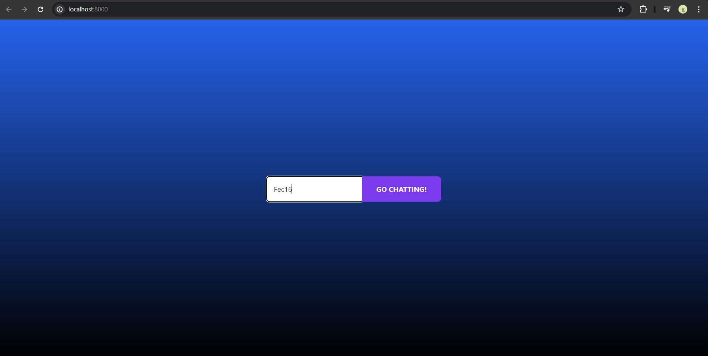
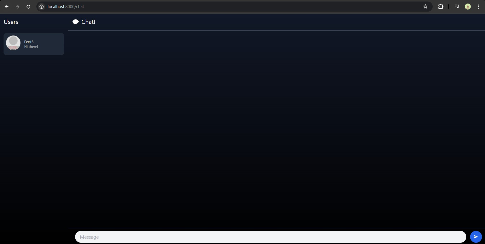

## Reflection

#### 3.1. Original code
 

 

 

#### 3.2. Add some creativities to the webclient
 

 

On the login page, I enhanced the background by adding a gradient from blue to black in the HTML code located in `src/components/login.rs`. 

This gives the impression of diving into the sea. Then, on the chat page, I transformed the background to a dark mode, predominantly dark in color to reduce eye strain during chats, by modifying the HTML code in `src/components/chat.rs`.